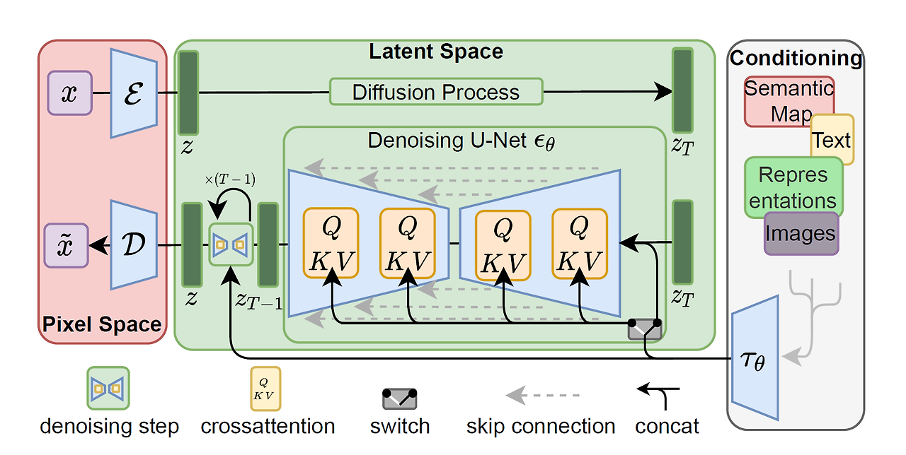
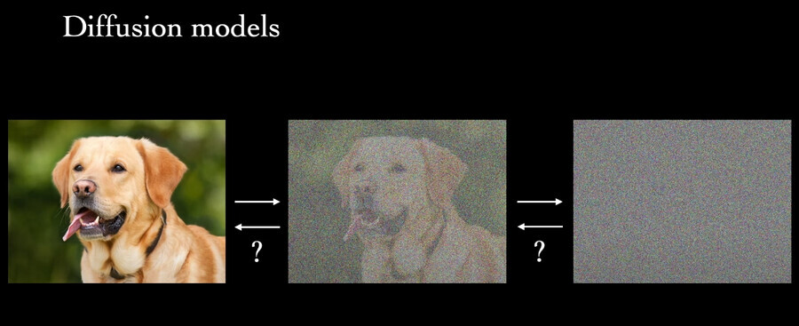

## 1. Stable Diffusion 이란?

Stable Diffusion은 text-to-image 딥러닝 모델이다.

Latent Diffusion 모델의 일종이며, 잠재 확산 모델을 이용한 고해상도 이미지 합성 연구를 기반으로 만들어졌다.

[github](https://github.com/CompVis/stable-diffusion)  

## 2. latent diffusion의 구조

[논문](https://arxiv.org/abs/2112.10752)  

---

#### 1. Pixel Space (픽셀 공간)
`x`: 원본 이미지

- 모델이 처리하려는 **시작점** 의 이미지 (고화질)

`x̃` : 노이즈가 섞인 이미지

- 원본 이미지에 **노이즈 (잡음)** 를 섞어서 흐릿하거나 보기 힘든 상태로 만듦

`E`: 인코더 (Encoder)

- 이미지를 "압축된 정보"(Latent Space) 로 바꿈

`D`: 디코더 (Decoder)

- 압축된 정보를 다시 사람이 볼 수 있는 이미지로 복원 (노이즈 제거)

---

### 2. Latent Space (잠재 공간)

1. Diffusion Process (확산 과정)

- 원본 이미지에 랜덤 노이즈를 더해 복잡한 이미지로 변형
- 모델이 노이즈를 다시 되돌려서 깨끗한 이미지를 복원하도록 학습

Denoising U-Net (잡음 제거 U-Net)

U-Net : 노이즈 제거의 중심 모델

- 노이즈가 많은 이미지 `zT` 를 입력 받음 (상위 예시 내에서는 `xT`)
- 작은 단위로 나누어 이미지를 처리하고, 각 단계를 거쳐(`zT → zT-1 → ... → z0`) 점진적으로 개선
- 점차 깨끗한 이미지로 만듦
---

2. Scheduler (스케줄러)
그림에서 노이즈를 추가하고 제거하는 반복 과정을 관리하는 영역

- 노이즈를 추가하는 과정 (Forward Process):`z → zT`로 진행되는 과정(왼쪽에서 오른쪽 화살표)
이 단계에서, 스케줄러는 노이즈의 강도와 종류를 설정

- 노이즈를 제거하는 과정 (Reverse Process): `zT → zT-1 → z0`로 진행되는 과정(오른쪽에서 왼쪽 화살표)
U-Net이 노이즈를 제거하며 이미지를 점진적으로 복원하는데, 이때 스케줄러가 어느 정도로 노이즈를 제거할지 결정

- 스케줄러의 종류

1. DDPM (Denoising Diffusion Probabilistic Models):기본적인 스케줄러로, 확률적인 방식을 사용해 노이즈를 추가/제거
각 단계가 엄격하게 정의되어 있으며 계산이 상대적으로 느림

2. DDIM (Denoising Diffusion Implicit Models):
좀 더 효율적으로 노이즈를 제거하는 방법
반복 횟수를 줄일 수 있어 계산 속도가 빠름

3. Euler/Euler a:
확률 편미분 방정식(SDE)을 이용하여 더 정교하게 노이즈를 처리. 특히 고화질 이미지 생성에 자주 사용

4. DPM++:
최신 스케줄러, 효율성과 품질을 모두 고려한 방식
Stable Diffusion에서 고화질 이미지를 빠르게 생성할 때 자주 사용

## 3. Cross-Attention (교차 주의 메커니즘)

조건을 참고하여 복구 할 때 작업을 더 정밀하게 수행

- **Q, K, V (Query, Key, Value)** 라는 메커니즘 사용

1)  Query (Q): "이 부분에 관심을 가져야 한다"
- 현재 이미지에서 **중요한 정보(특정 부분)**를 찾기 위한 신호

2)  Key (K): "참고해야 할 정보."
- 모델이 참고해야 할 외부 정보(입력 텍스트, 조건 이미지 등)

3)  Value (V): "실제로 사용할 정보."
- 매칭된 정보를 기반으로, 필요한 데이터만 가져와서 이미지 복구나 생성 과정에 활용

## 4. Conditioning (조건 정보)

사용자가 제공한 조건(텍스트, 이미지 등)을 바탕으로 원하는 스타일, 내용, 또는 세부 사항이 반영된 이미지를 생성

1. 텍스트 (Text)
자연어 설명을 입력하여, 이미지 생성 결과를 텍스트 내용에 맞추는 방식

2. 이미지 (Images)
조건으로 제공된 참조 이미지를 기반으로, 비슷한 스타일이나 구성을 가진 새로운 이미지 생성

3. Representations(잠재 표현)
데이터의 원래 형태(예: 텍스트, 이미지 등)를 추상화하거나 숫자 벡터로 변환하여 모델이 처리할 수 있도록 만든 결과물

4. Semantic Map (의미 지도)
이미지의 구조나 영역별 의미(예: 건물, 나무, 도로 등)를 나타내는 정보

`τθ` : 조건 정보를 **Latent Space(잠재 공간)** 에 연결하여 활용하도록 도움

