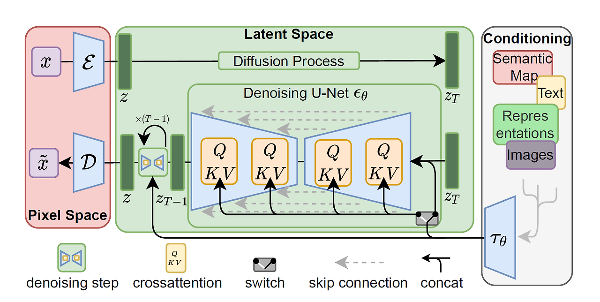

## 1. Stable Diffusion 이란?

Stable Diffusion은 text-to-image 딥러닝 모델이다.

Latent Diffusion 모델의 일종이며, 잠재 확산 모델을 이용한 고해상도 이미지 합성 연구를 기반으로 만들어졌다.

[github](https://github.com/CompVis/stable-diffusion)  

## 2. latent diffusion의 구조

[논문](https://arxiv.org/abs/2112.10752)  

#### 1. Pixel Space
`x`: 원본 이미지
`x̃` : 노이즈가 섞인 이미지

