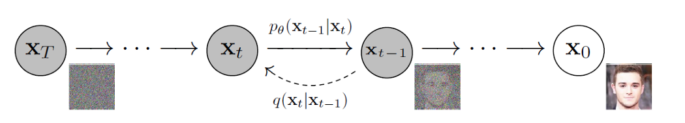
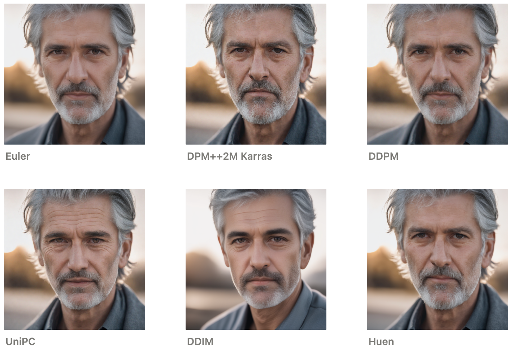

# Stable Diffusion 이란?

Latent Diffusion 모델의 일종으로, text-to-image 딥러닝 모델

[논문](https://arxiv.org/abs/2112.10752)    /   [github](https://github.com/CompVis/stable-diffusion)

---

# 구조

---

#### 1. Pixel Space (픽셀 공간)

`x`: 원본 이미지

- 모델이 처리하려는 시작점 의 이미지 (고화질)

`x̃` : 노이즈가 섞인 이미지

- 원본 이미지에 노이즈 (잡음) 를 섞어서 흐릿하거나 보기 힘든 상태로 변화된 이미지

`E`: 인코더 (Encoder)

- 이미지를 "압축된 정보"(Latent Space) 로 변경 (노이즈 삽입)

`D`: 디코더 (Decoder)

- 압축된 정보를 다시 사람이 볼 수 있는 이미지로 복원 (노이즈 제거)

---

#### 2. Latent Space (잠재 공간)

1. Diffusion Process (확산 과정)

- 원본 이미지에 랜덤 노이즈를 더해 복잡한 이미지로 변형
- 모델이 노이즈를 다시 되돌려서 깨끗한 이미지를 복원하도록 학습

2. Denoising U-Net (잡음 제거 모델)

- 노이즈가 많은 이미지 `zT` 를 입력 받음 (상위 예시 내에서는 `xT`)
- 작은 단위로 나누어 이미지를 처리하고, 각 단계를 거쳐(`zT → zT-1 → ... → z0`) 점진적으로 개선
- 점차 깨끗한 이미지로 만듦
---

#### 3. Scheduler (스케줄러)

그림에서 노이즈를 추가하고 제거하는 반복 과정을 관리하는 영역

- 노이즈를 추가하는 과정 (Forward Process):`z → zT`로 진행되는 과정(왼쪽에서 오른쪽 화살표)
이 단계에서, 스케줄러는 노이즈의 강도와 종류를 설정

- 노이즈를 제거하는 과정 (Reverse Process): `zT → zT-1 → z0`로 진행되는 과정(오른쪽에서 왼쪽 화살표)
U-Net이 노이즈를 제거하며 이미지를 점진적으로 복원하는데, 이때 스케줄러가 어느 정도로 노이즈를 제거할지 결정

스케줄러의 종류

1. **Euler**
- 이미지의 디테일이 적당히 유지되며, 부드러운 스타일을 제공
- 매우 효율적이고, 반복 횟수(Steps)가 적더라도 결과물이 안정적

2. **DPM++ 2M Karras**
- Denoising Diffusion Probabilistic Models의 발전된 버전
- 2M은 2차(momentum)-기반 방식을 의미하며, 복잡한 노이즈 제거 과정을 효율적으로 처리
- arras 스케줄링 방식을 적용하여 이미지의 디테일과 높은 품질

3. **DDPM (Denoising Diffusion Probabilistic Models)**
- Diffusion 모델의 기본 알고리즘
- 단계별로 매우 정교한 계산을 하며, 안정적이지만 낮은 처리 속도
- 결과물이 부드럽고 자연스럽게 생성

4. **UniPC (Unified Predictor-Corrector)**
- Predictor(예측)와 Corrector(보정) 단계를 결합하여, 매우 빠르고 안정적인 이미지 생성 가능
- 다양한 이미지 스타일에서 높은 성능

5. **DDIM (Denoising Diffusion Implicit Models)**
- DDPM의 변형으로, 노이즈 제거 과정에서 중간 계산 단계를 줄여 속도를 높인 방식
- 빠르게 결과를 얻을 수 있지만, 디테일이 DDPM이나 DPM++보다는 조금 부족

6. **Huen**
- Heun's Method를 사용하는 샘플러로, 오일러 방식(Euler)의 개선된 형태
- 노이즈 제거 계산에서 좀 더 정확한 예측 제공
- 결과물이 부드럽고 디테일도 적당히 유지

## 4. Conditioning (조건 정보)

사용자가 제공한 조건(텍스트, 이미지 등)을 바탕으로 원하는 스타일, 내용, 또는 세부 사항이 반영된 이미지를 생성

1. 텍스트 (Text)
자연어 설명을 입력하여, 이미지 생성 결과를 텍스트 내용에 맞추는 방식

2. 이미지 (Images)
조건으로 제공된 참조 이미지를 기반으로, 비슷한 스타일이나 구성을 가진 새로운 이미지 생성

3. Representations(잠재 표현)
데이터의 원래 형태(예: 텍스트, 이미지 등)를 추상화하거나 숫자 벡터로 변환하여 모델이 처리할 수 있도록 만든 결과물

4. Semantic Map (의미 지도)
이미지의 구조나 영역별 의미(예: 건물, 나무, 도로 등)를 나타내는 정보

`τθ` : 조건 정보를 Latent Space(잠재 공간) 에 연결하여 활용하도록 도움

---

## 5. 5가지 메커니즘

1. **Denoising Step**: 노이즈가 섞인 상태(`zT`)를 입력받아 처리 시작
2. **Switch**: 데이터를 분리하여 각 경로(조건 정보, 이미지 정보)로 전달
3. **Cross-Attention**: 조건 정보를 현재 상태의 이미지에 반영
4. **Skip Connection**: 인코더에서 추출한 세부 정보를 디코더로 전달
5. **Concat**: Skip Connection의 정보와 디코더 정보를 결합

---

#### 1. Denoising Step

반복(iteration) 과정에서 이미지의 노이즈를 점진적으로 제거

- 노이즈가 섞인 상태(`zT`)에서 조금 더 깨끗한 상태(`zT-1`)로 이미지 복구
- 이 단계는 반복적으로 실행되며, 최종적으로 깨끗한 이미지(`z0`) 생성
- 한 번의 Denoising Step마다 내부에서 Skip Connection, Cross-Attention, Concat 등이 실행됨

---

#### 2. Switch

입력된 데이터를 "어떤 경로로 보낼지"를 결정

- 데이터가 Encoder로 전달될지, Cross-Attention으로 전달될지, Decoder로 바로 전달될지를 제어
- 조건 정보(Conditioning)는 Cross-Attention으로 전달되고, 주요 이미지 정보는 Denoising U-Net의 내부로 이동

---

#### 3. Cross-Attention

조건을 참고하여 복구 할 때 작업을 더 정밀하게 수행

- **Q, K, V (Query, Key, Value)** 라는 메커니즘 사용

1)  Query (Q): 현재 이미지 상태의 정보
- 현재 이미지에서 중요한 정보(특정 부분)를 찾기 위한 신호

2)  Key (K): 조건 정보
- 모델이 참고해야 할 외부 정보(입력 텍스트, 조건 이미지 등)

3)  Value (V): 이미지에 반영될 핵심 정보
- 매칭된 정보를 기반으로, 필요한 데이터만 가져와서 이미지 복구나 생성 과정에 활용

---

#### 4. Skip Connection (스킵 연결)

인코더(Encoder) 단계에서 추출한 정보를 디코더(Decoder) 단계로 직접 연결하는 메커니즘

- 중간 과정에서 잃어버릴 수 있는 이미지의 세부 정보를 보존

---

#### 5. Concat

Skip Connection의 데이터를 디코더에 전달할 때 실행

- Skip Connection으로 전달된 원본 이미지의 세부 정보와, 디코더가 생성한 중간 이미지를 병합
- 원본 정보와 생성된 정보를 모두 활용하여 최종 이미지를 복원

