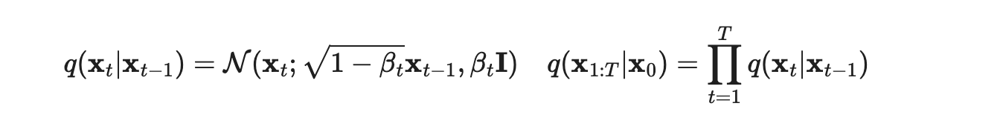
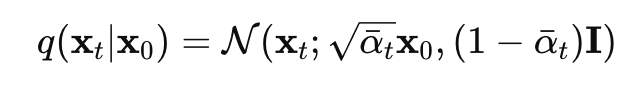

# Diffusion Model 의 핵심 공식

## 1. diffusion process
원본 데이터를 점진적으로 노이즈화하는 과정

## 2. Cumulative Forward Process
Forward Process의 전체 과정을 하나의 식으로 축약

## 3. Reverse diffusion process
노이즈에서 원본 데이터를 복원하는 과정

## 4. Training Objective
Reverse Process를 학습하는데, 이 과정에서 사용되는 손실 함수

